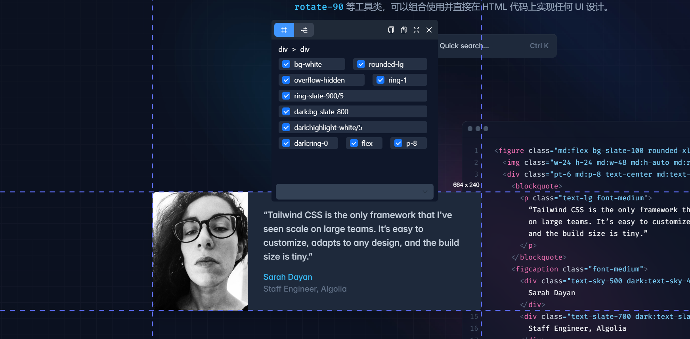
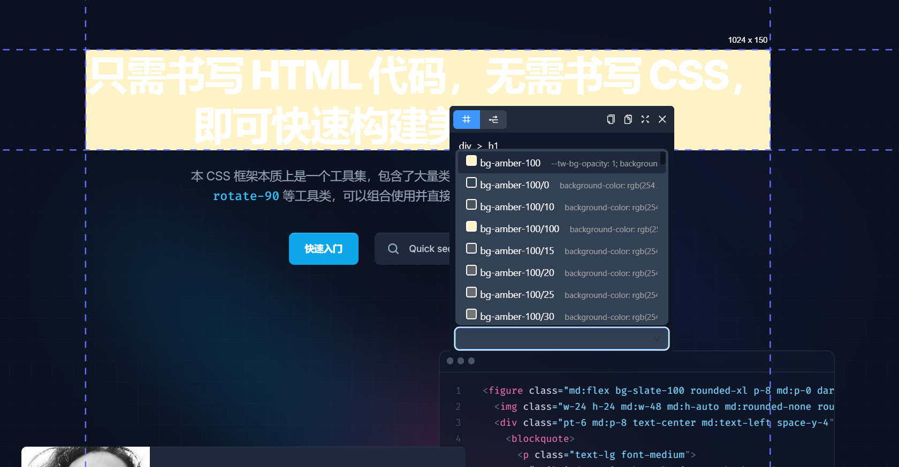

###### 启动命令

```
pnpm run dev 
pnpm run build 
pnpm run zip
```

###### 已完成功能
- 悬停显示元素信息高亮显示
- 元素class可选可删除
- 添加tialwind css 类和补全信息
- 复制元素样式 dom整体


###### 待完成
- copy 原生css转成 tailwind css


###### 运行截图




###### 项目目录

```
.
├── .gitignore  # Git忽略文件，列出在版本控制中要忽略的文件和目录
├── assets  # 静态资源文件夹
│   └── ...静态资源
├── entrypoints  # 入口点文件夹
│   ├── background.ts  # Chrome扩展的后台脚本
│   ├── components  # 组件文件夹
│   │   ├── element_info  # 元素信息相关组件
│   │   │   ├── card_head.tsx  # 卡片头部组件
│   │   │   ├── card_input.tsx  # 卡片输入组件
│   │   │   ├── element_card.tsx  # 元素卡片组件
│   │   │   └── element_info.tsx  # 元素信息组件
│   │   └── spotlight  # 聚焦组件
│   │       └── spotlight.tsx  # 聚焦组件实现
│   ├── content.tsx  # 内容脚本
│   ├── hooks  # 自定义hooks
│   │   └── use_dynamic_styles.ts  # 动态样式的自定义hook
│   ├── rule  # 规则相关文件
│   │   └── rule.ts  # 规则定义
│   ├── store  # 状态管理
│   │   ├── element_card.ts  # 元素卡片状态管理
│   │   ├── mouse.ts  # 鼠标状态管理
│   │   └── rule.ts  # 规则状态管理
│   └── utils  # 工具函数
│       └── tools.tsx  # 工具函数实现
├── eslint.config.js  # ESLint配置文件
├── index.js  # 项目的入口文件
├── package.json  # 项目的依赖配置和元数据
├── pnpm-lock.yaml  # pnpm锁定文件，记录依赖的确切版本
├── public  # 公共资源文件夹
│   ├── css  # CSS文件夹
│   │   └── element_info  # 元素信息相关CSS
│   │       └── index.css  # 元素信息组件样式
│   ├── icon  # 图标文件夹
│   │   ├── 128.png  # 128x128图标
│   │   ├── 16.png  # 16x16图标
│   │   ├── 32.png  # 32x32图标
│   │   ├── 48.png  # 48x48图标
│   │   └── 96.png  # 96x96图标
│   └── wxt.svg  # WXT图标文件
├── README.md  # 项目说明文档
├── tsconfig.json  # TypeScript配置文件
├── uno.config.ts  # UnoCSS配置文件
└── wxt.config.ts  # WXT框架配置文件
```
